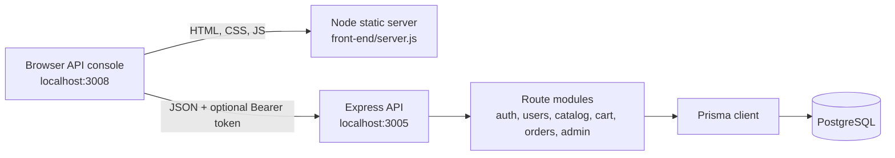
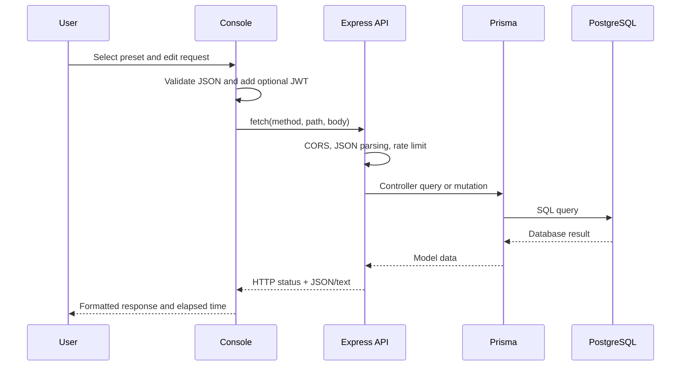
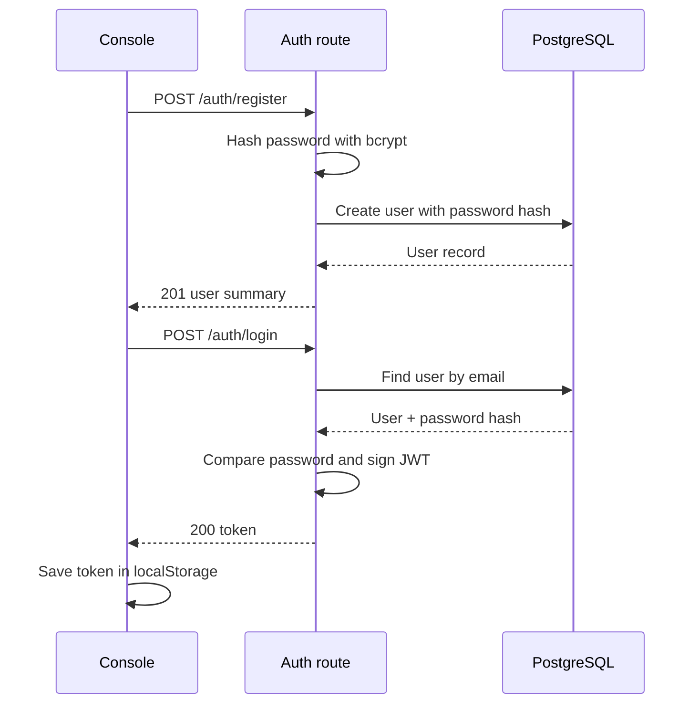
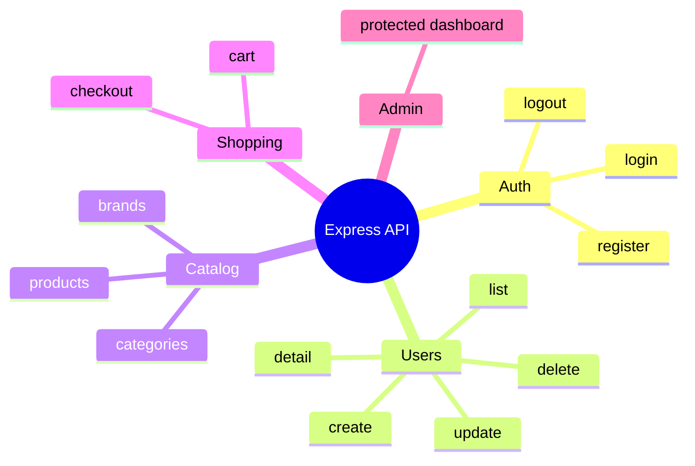

# Project diagrams

These diagrams describe the local API and its browser testing console.

## System architecture

```mermaid
flowchart LR
    Browser[Browser API console\nlocalhost:3008]
    Static[Node static server\nfront-end/server.js]
    API[Express API\nlocalhost:3005]
    Routes[Route modules\nauth, users, catalog, cart, orders, admin]
    Prisma[Prisma client]
    DB[(PostgreSQL)]

    Browser -->|HTML, CSS, JS| Static
    Browser -->|JSON + optional Bearer token| API
    API --> Routes
    Routes --> Prisma
    Prisma --> DB
```

## Request lifecycle

```mermaid
sequenceDiagram
    participant U as User
    participant C as Console
    participant A as Express API
    participant P as Prisma
    participant D as PostgreSQL

    U->>C: Select preset and edit request
    C->>C: Validate JSON and add optional JWT
    C->>A: fetch(method, path, body)
    A->>A: CORS, JSON parsing, rate limit
    A->>P: Controller query or mutation
    P->>D: SQL query
    D-->>P: Database result
    P-->>A: Model data
    A-->>C: HTTP status + JSON/text
    C-->>U: Formatted response and elapsed time
```

## Authentication flow

```mermaid
sequenceDiagram
    participant C as Console
    participant A as Auth route
    participant DB as PostgreSQL

    C->>A: POST /auth/register
    A->>A: Hash password with bcrypt
    A->>DB: Create user with password hash
    DB-->>A: User record
    A-->>C: 201 user summary

    C->>A: POST /auth/login
    A->>DB: Find user by email
    DB-->>A: User + password hash
    A->>A: Compare password and sign JWT
    A-->>C: 200 token
    C->>C: Save token in localStorage
```

## Route groups

```mermaid
mindmap
  root((Express API))
    Auth
      register
      login
      logout
    Users
      list
      detail
      create
      update
      delete
    Catalog
      products
      categories
      brands
    Shopping
      cart
      checkout
    Admin
      protected dashboard
```
